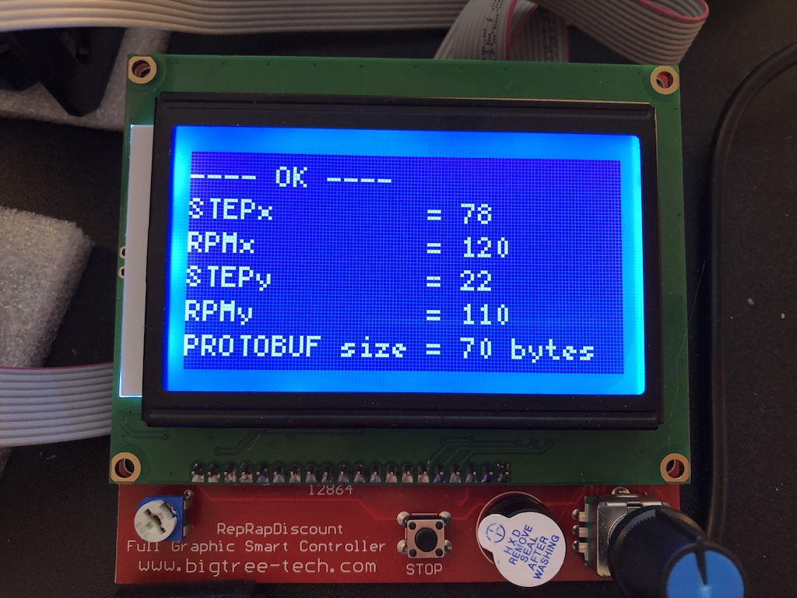

## Presentation
This project aims to receive commands and pilot several stepper motors


## Details

* Infra: LAN <-> Raspberry PI 3 <-> SERIAL USB <-> ARDUINO MEGA 2560 <-> LCD 12864/RAMPS 1.4 <-> N x NEMA 17 stepper motors

* Software/Design : MQTT <-> PROTOBUF <-> PYTHON <-> C++ <-> U8g2/StepperDriver * 

This design allows a distributed environment. Motors are remotely piloted, no high-level logic here this repo only handle the communication protocol and sending appropriate commands to the motors. Blue LCD embarked with the robot and motors is showing debug informations.

## Setup

```
$ cd protobuf
$ generate_files.sh
```

